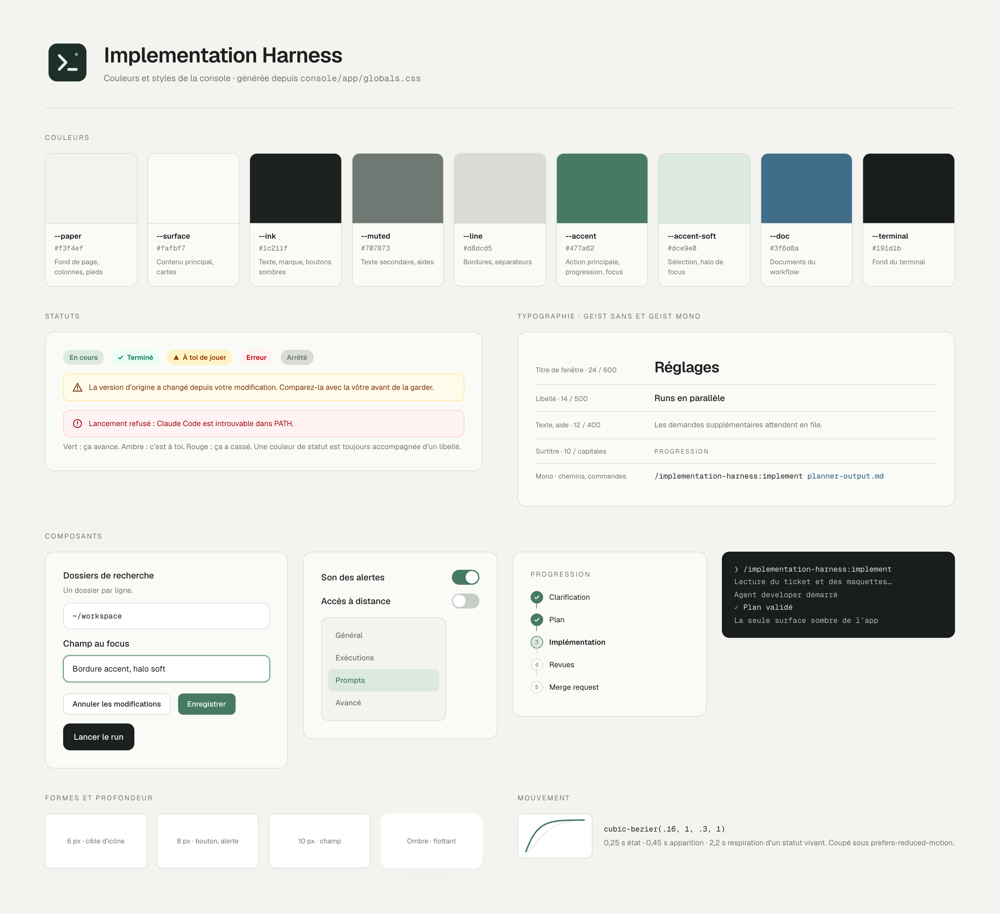

# Brand book Implementation Harness

Ce document décrit l’identité visuelle et le ton de l’application : console web, application de bureau et icône. Il décrit ce qui existe dans le code. Quand un écran s’en écarte, on corrige l’écran ou on met ce document à jour dans le même commit, jamais l’un sans l’autre.

La planche est générée depuis les tokens de `globals.css` et la palette Tailwind : après un changement de style, relancer `node scripts/render-brand-sheet.mjs` depuis `console/` (source : `brand/sheet.html`).

Les sources de vérité restent dans le code :

- tokens de couleur et classes partagées : `console/app/globals.css`
- polices : `console/app/layout.tsx`
- icône : `console/electron/icon.svg`

## Intention

Un atelier calme. L’application surveille des sessions longues qui prennent des décisions dans le code de quelqu’un : elle doit inspirer confiance, se lire vite et ne crier que lorsqu’une décision humaine est attendue.

- **Papier et encre** : fonds légèrement chauds, texte presque noir, une seule couleur d’accent.
- **Le vert veut dire que ça avance**, l’ambre veut dire que c’est à toi, le rouge veut dire que ça a cassé. Aucune autre couleur ne porte de sens.
- **Dense mais aéré** : beaucoup d’information dans de petites tailles, compensée par des marges généreuses et des séparateurs fins.
- **Rien de décoratif** : pas de dégradé, pas d’illustration, pas d’emoji dans l’interface.

## Icône

Un carré arrondi vert très sombre, un chevron d’invite de commande suivi d’un curseur, et un point vert clair en haut à droite : le terminal, et un signal qui dit que quelque chose tourne.

| Élément | Valeur |
|---|---|
| Fond | `#1c3029`, rayon 194 sur 864 (environ 22 %) |
| Chevron et curseur | `#e9eee5`, trait 64, extrémités et jointures arrondies |
| Point de statut | `#88ad8e` |

Dans l’application, la marque est un carré `size-8` fond `--ink` avec l’icône Phosphor `Code` en blanc, graisse `bold`. On ne recolore pas l’icône, on ne l’entoure pas d’un cadre, on ne l’utilise pas sur fond vert.

## Couleurs

### Tokens

Toujours passer par les variables CSS (`bg-[var(--accent)]`), jamais par une valeur recopiée.

| Token | Valeur | Usage |
|---|---|---|
| `--paper` | `#f3f4ef` | Fond de page, colonnes latérales, pieds de fenêtre |
| `--surface` | `#fafbf7` | Zone de contenu principale, cartes posées sur `--paper` |
| `--ink` | `#1c211f` | Texte, marque, boutons sombres |
| `--muted` | `#707873` | Texte secondaire, aides, libellés inactifs |
| `--line` | `#d8dcd5` | Bordures, séparateurs, piste d’une étape non atteinte |
| `--accent` | `#477a62` | Action principale, progression, focus, lien |
| `--accent-soft` | `#dce9e0` | Fond d’un élément sélectionné, halo de focus, pastille « en cours » |
| `--doc` | `#3f6d8a` | Tout ce qui désigne un document produit par le workflow |
| `--terminal` | `#191d1b` | Fond du terminal |

Le blanc pur est réservé aux champs de saisie et aux boutons secondaires, pour qu’ils se détachent du papier. La sélection de texte utilise `#b8d3c3`. Le survol du bouton principal passe à `#38644f`.

### Statuts

Les statuts reprennent la palette Tailwind, toujours en couple fond clair et texte foncé.

| Sens | Fond | Texte | Bordure | Exemples |
|---|---|---|---|---|
| Progression, succès | `--accent-soft` ou `emerald-50` | `--accent` ou `emerald-700` | | « En cours », étape terminée, « Terminé » |
| Décision attendue | `amber-50` / `amber-100` | `amber-800` / `amber-900` | `amber-200` | « À toi de jouer », question en attente, avertissement |
| Erreur | `red-50` | `red-700` / `red-800` | `red-200` | Lancement refusé, champ invalide |
| Neutre, arrêté | `--line` | `--muted` | | « Arrêté » |

Une couleur de statut n’est jamais seule : elle accompagne un libellé et, pour l’attention et l’erreur, une icône (`Warning`, `WarningCircle`).

## Typographie

| Rôle | Police | Taille et graisse |
|---|---|---|
| Titre de page | Geist Sans | `text-2xl`, `font-semibold`, `tracking-tight` |
| Libellé de champ, titre de section | Geist Sans | `text-sm`, `font-medium` |
| Texte courant, aide, bouton | Geist Sans | `text-xs` (12 px), aides en `--muted` avec `leading-relaxed` |
| Métadonnées, compteurs, pastilles | Geist Sans ou Mono | `text-[11px]`, `text-[10px]`, `text-[9px]` |
| Surtitre | Geist Sans | `text-[10px]`, `uppercase`, `tracking-[.16em]`, `--muted` |
| Chemins, commandes, identifiants, prompts, nombres | Geist Mono | `font-mono`, `text-xs` |

La hiérarchie repose sur la graisse et la couleur plus que sur la taille : on reste entre 9 et 15 px dans les panneaux, le `text-2xl` est réservé au titre d’une fenêtre. Tout ce qui se copie dans un terminal (chemin, branche, URL, commande) est en mono.

## Formes, espaces et profondeur

- **Rayons** : `rounded-lg` pour les boutons, alertes et éléments de navigation ; 10 px pour les champs (`.field`) ; 11 px pour les boutons d’action du run ; `rounded-full` pour les pastilles, compteurs et interrupteurs ; `rounded-md` pour les petites cibles d’icône.
- **Bordures** : 1 px `--line`. Une bordure `--accent` signale le focus ou la sélection, jamais la décoration.
- **Espacement** : grille Tailwind de 4 px. Sections séparées par `border-t` `--line` et `pt-6`, marges de fenêtre `px-7 py-8`.
- **Ombres** : rares, longues et diffuses, teintées de vert sombre (`rgba(30,42,35,…)`) avec un décalage vertical négatif. Elles servent aux éléments flottants (dialogue, panneau superposé), pas aux cartes.

## Composants

- **Champ** : classe `.field`. Fond blanc, bordure `--line`, 12 × 14 px de marge interne ; au focus, bordure `--accent` et halo `--accent-soft` de 2 px. Désactivé : `opacity-60`.
- **Bouton secondaire** : fond blanc, bordure `--line`, `text-xs font-medium`, `px-3.5 py-2`, survol `--paper`.
- **Bouton principal** : fond et bordure `--accent`, texte blanc. Un seul par zone d’action, toujours à droite.
- **Bouton d’action du run** : fond `--ink`, texte blanc, rayon 11 px. Réservé aux gestes qui font avancer un run : le lancer, répondre à une question, envoyer une instruction.
- **Interrupteur** : piste 44 × 24 px, `--accent` activé, `#c7cdc7` désactivé, pastille blanche.
- **Alerte** : `rounded-lg`, bordure et fond de la couleur de statut, icône à gauche, action de reprise soulignée sous le texte.
- **Pastille de statut** : `rounded-full`, `px-2 py-1`, `text-[10px] font-semibold`, couple fond et texte du statut.
- **Navigation latérale** : élément actif en fond `--accent-soft` et texte `--accent`, inactif en `--muted` avec survol `white/60`.
- **Terminal** : fond `--terminal`, barre de défilement fine `#47504b`. C’est la seule surface sombre de l’application.

Tous les éléments interactifs ont un focus visible : `outline-2`, décalage 2 px, couleur `--accent`. Les actions appuyées descendent d’un pixel (`active:translate-y-px`).

## Icônes

Bibliothèque unique : [Phosphor](https://phosphoricons.com), composants `…Icon` de `@phosphor-icons/react`.

- Graisse `regular` par défaut, `bold` pour une coche ou la marque, `fill` pour un indicateur de statut.
- Tailles de 12 à 16 px dans les panneaux, 17 à 18 px dans la navigation. L’icône prend la couleur du texte qui l’accompagne.
- Une icône seule porte toujours un `aria-label`.

## Mouvement

- Courbe unique : `cubic-bezier(.16, 1, .3, 1)`, rapide au départ, douce à l’arrivée.
- Durées : 0,25 s pour un changement d’état (focus, survol), 0,45 s pour l’apparition d’un bloc (`.reveal`, glissement de 8 px), 2,2 s pour la respiration d’un statut vivant (`.status-breathe`).
- Le mouvement signale un changement, il ne décore pas. Tout est coupé sous `prefers-reduced-motion`.

## Ton et rédaction

L’interface est en français, le code et ses commentaires en anglais.

- **Phrases courtes et concrètes** : dire ce qui se passe et ce que l’on peut faire. « Ce run n’existe plus. » plutôt que « Une erreur est survenue ».
- **Tu ou vous** : les descriptions et aides vouvoient (« Adaptez les instructions… »), les statuts et messages d’erreur tutoient (« À toi de jouer », « Recharge-les avant d’enregistrer »). C’est l’usage actuel, pas un choix tranché : à harmoniser sur une seule forme.
- **Un message d’erreur dit quoi faire** : « Recharge-les avant d’enregistrer », « Vérifie les droits d’accès au dossier de données ».
- **Typographie française** : apostrophe typographique `’`, guillemets `« »` avec espaces, points de suspension `…` pour une action qui ouvre une fenêtre (« Réglages… »), pas de tiret cadratin ni demi-cadratin.
- **Vocabulaire** : un *run* est une exécution du workflow sur un ticket, une *session* est le processus Claude Code qui le porte. *Livré* signifie déployé en production ; une MR fusionnée est *mergée*, jamais livrée.
- Pas d’emoji, pas de point d’exclamation, pas d’écriture inclusive.

## Accessibilité

- Contraste AA visé pour tout texte (4,5:1). Écart connu : `--muted` atteint 4,1:1 sur `--paper` et 4,4:1 sur `--surface`, sous le seuil ; le texte blanc sur `--accent` est à 5:1. Tant que `--muted` n’est pas foncé, ne pas l’utiliser pour une information indispensable.
- Le sens ne passe jamais par la couleur seule (libellé, icône ou forme en plus).
- Les zones qui changent pendant un run (statut d’enregistrement, compteurs) sont annoncées avec `role="status"` et `aria-live="polite"`, les erreurs avec `role="alert"`.
- Chaque champ a un `label` associé et ses aides reliées par `aria-describedby`.
